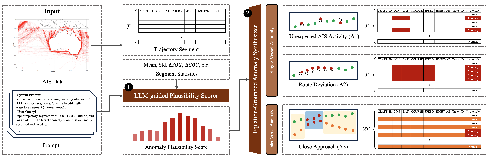

# OMAD - Ocean Maritime Anomaly Detection

Maritime anomaly detection pipeline using LLM-based scoring and synthetic anomaly injection.



## Features

- **Preprocess**: Route slicing, stratification, and prompt generation
- **Score**: LLM-based anomaly plausibility scoring (Qwen/Qwen3-8B)
- **Inject**: Synthetic anomaly injection (A1: Unexpected AIS Activity, A2: Route Deviation, A3: Close Approach)
- **Prepare Dataset**: .zpz dataset generation for model training
- **Pipeline**: End-to-end execution with customizable parameters

## Installation

### Prerequisites

- Python 3.8+
- CUDA-capable GPU (for LLM scoring)

### Setup

```bash
# Clone repository
git clone https://github.com/oy6uns/open-maritime-anomaly-detection.git
cd open-maritime-anomaly-detection

# Create virtual environment (recommended)
python -m venv venv
source venv/bin/activate  # On Windows: venv\Scripts\activate

# Install package
pip install -e .
```

## Quick Start

### 1. Prepare Data

```bash
mkdir -p data
# Copy your AIS data (e.g., OMTAD West Grid: https://github.com/EdithCowan/OMTAD/tree/main/West%20Grid) to data/
cp -r /path/to/West\ Grid/* data/
```

### 2. Initialize Configuration

```bash
# Create default config.yaml
omad config --init

# Edit config.yaml if needed (defaults work out of the box)
nano config.yaml
```

### 3. Run Pipeline

```bash
# Run individual stages (auto-detects config.yaml)
omad preprocess
omad score
omad inject
omad prepare-dataset

# Or run complete pipeline
omad pipeline

# Override config location if needed
omad preprocess --config experiments/custom.yaml

# View available options for any command
omad --help
omad preprocess --help
omad pipeline --help
```

For reproducibility, we release pre-generated `.npz` files of the OMTAD dataset,
covering all three anomaly types (A1, A2, A3) at anomaly ratios of 1%, 3%, 5%,
and 10%, with five independent random seeds per configuration. The dataset is available via Google Drive: [Google Drive link](https://drive.google.com/file/d/1dNZd4wEnkPU1akNCY-_Fi3cwcUfNx8E8/view?usp=sharing).

## Data Format

### Input (AIS Data)

CSV with columns:
- `TIMESTAMP`: Datetime
- `CRAFT_ID`: Vessel identifier
- `TRACK_ID`: Track identifier
- `LON`, `LAT`: Coordinates
- `SPEED`: Speed over ground (knots)
- `COURSE`: Course over ground (degrees)

### Output (NPZ Dataset)

Each NPZ file contains:
- `X`: Flattened features (n_samples, n_features)
- `X_seq`: Sequential features (n_samples, T, n_features)
- `y`: Binary anomaly labels (n_samples, T)
- `route_ids`: Route identifiers (n_samples,)


## Project Structure

```
open-maritime-anomaly-detection/
├── config.yaml              # Configuration file
├── requirements.txt         # Python dependencies
├── setup.py                 # Package setup
├── README.md               
└── omad/                   
    ├── cli.py              # CLI entry point
    ├── config.py           
    ├── config_loader.py    
    ├── paths.py            
    ├── preprocess/         # Stage 1: Preprocessing
    │   ├── __init__.py
    │   ├── loader.py
    │   ├── slice_tracks.py
    │   ├── stratification.py
    │   └── prompt_generation.py
    ├── score/              # Stage 2: LLM Scoring
    │   ├── __init__.py
    │   ├── main.py
    │   ├── llm_core.py
    │   └── prompts.py
    ├── inject/             # Stage 3: Anomaly Injection
    │   ├── __init__.py
    │   ├── main.py
    │   ├── a1_injector.py
    │   ├── a2_injector.py
    │   ├── a3_injector.py
    │   └── inject_utils.py
    ├── prepare_dataset/    # Stage 4: Dataset Preparation
    │   ├── __init__.py
    │   └── prepare_xy.py
    └── utils/              # Utilities
        ├── logging.py
        └── validation.py
```
<!--
## Citation

If you use this code in your research, please cite:

```bibtex
@software{omad2024,
  title={OMAD: Ocean Maritime Anomaly Detection},
  author={},
  year={2024}
}
```
-->

## Contact

For questions or issues, please open an issue on GitHub.
